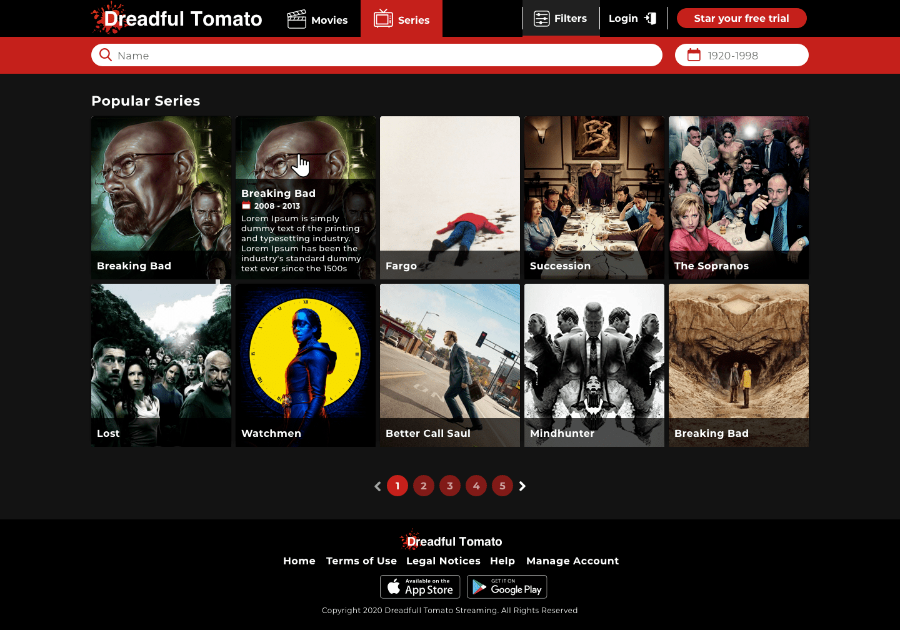
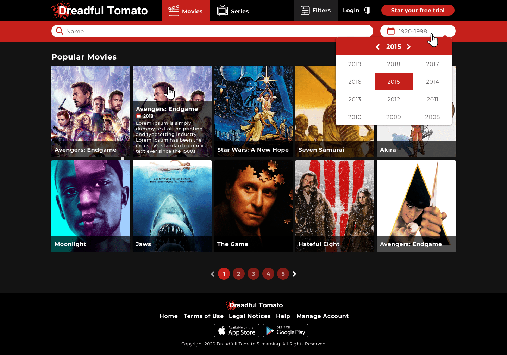
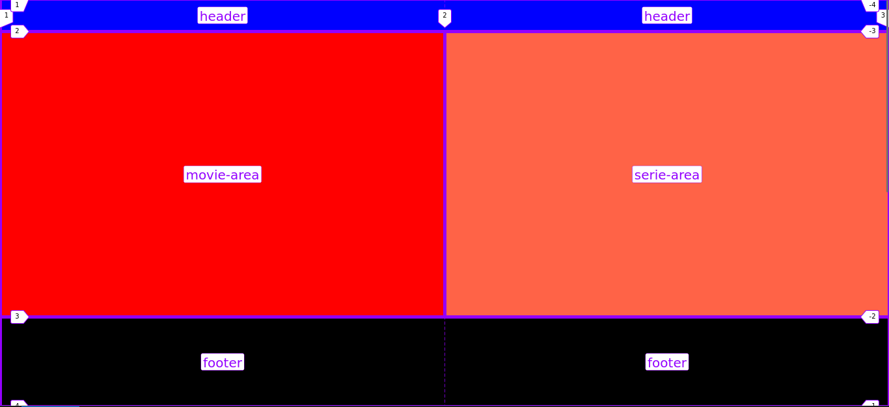
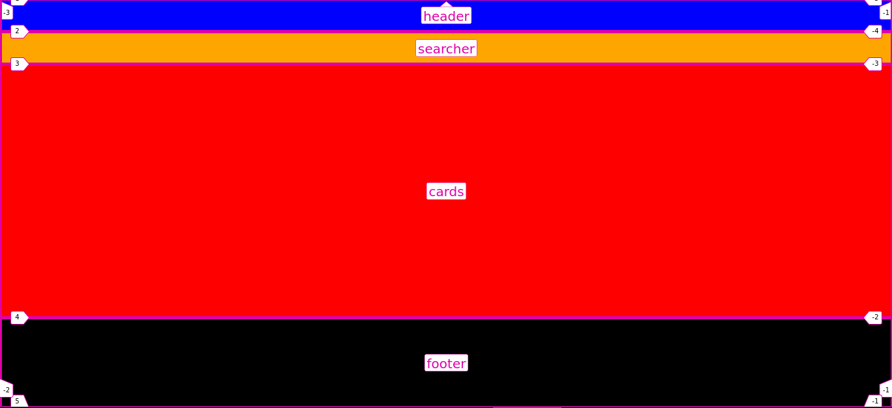

# Dreadful Tomato Project

## Challenge

Dreadful Tomato is a new platform to find new movies and TV shows. The main objective is to
help users to find information about their favourite TV shows and movies.

To do so, the company has to create a new web app that allow users do some fancy things.

### Refereneces:

## Development process

### Templates

At first, using CSS Grid I create the templates of the two main pages where I will implement the
components.

**Principal Template**

**Catalog Template**

### Components

